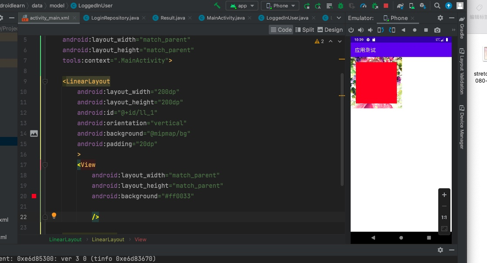

# Android 基础

## 文件分析
res/layout 布局文件

AndroidManifest.xml 每一个activity都要在里面
```xml
<?xml version="1.0" encoding="utf-8"?>
<manifest xmlns:android="http://schemas.android.com/apk/res/android"
    xmlns:tools="http://schemas.android.com/tools"
    package="com.qin.androidlearn">

    <application
        android:allowBackup="true"
        android:dataExtractionRules="@xml/data_extraction_rules"
        android:fullBackupContent="@xml/backup_rules"
        android:icon="@mipmap/ic_launcher"
        android:label="@string/app_name"
        android:roundIcon="@mipmap/ic_launcher_round"
        android:supportsRtl="true"
        android:theme="@style/Theme.AndroidLearn"
        tools:targetApi="31">
        <activity
            android:name=".InfaceUI" 
            android:exported="false" /> <!-- 一个简单的注册 -->
        <activity
            android:name=".MainActivity" 
            android:exported="true"><!-- . 包名 （com.qin.androidlearn，这没有显示全部，在上面）类名-->
            <intent-filter><!-- 设置启动的第一个启动点-->
                <action android:name="android.intent.action.MAIN" />

                <category android:name="android.intent.category.LAUNCHER" />
            </intent-filter>
        </activity>
    </application>
</manifest>
```

每创建一个activity 都会有一个Java类与一个xml布局文件


```java
//Java类
public class MainActivity extends AppCompatActivity {

    @Override
    protected void onCreate(Bundle savedInstanceState) {
        super.onCreate(savedInstanceState);         //必须
        setContentView(R.layout.activity_main);     //必须 布局文件
    }
}
```

## 布局管理器
### 线性布局
    LinearLayout
常用属性
```xml
<LinearLayout>
android:id ID

android:layout_width 宽度 android:layout_width="200dp" 使用dp是因为各家手机厂家的分辨率不同，Android提供dp来适配

android:layout_hight 高度
android:background 背景

android:layout_margin 外边距

android:layout_padding 内边距 ,设置在父容器里

android:orientation 方向 竖屏或横屏

layout_weight 权重，一个空间分割
（match - 占用）/ 2
</LinearLayout>
```


### 相对布局
    RelativeLayout
常用属性
```xml
<RelativeLayout>
android:layout_toLeftOf

android:layout_toRightOf

android:layout_alignBottom

android:layout_alignParentBottom  跟父空间底部对齐

android:layout_below

</RelativeLayout>
```


## 组件
### TextView
    显示不下使用...
    文字大小、颜色
    文字+icon
    中划线、下划线
    跑马灯
文字大小、颜色
```xml
        
        android:text="噜啦噜啦嘞绿绿绿来了来了"
        android:textStyle="bold"
        android:textColor="#66ffcc"
        android:textSize="26sp"
        android:gravity="center"
        显示...
        android:maxLines="1"
        android:ellipsize="end"
```
文字+icon
```xml

<TextView
        android:layout_width="100dp"
        android:layout_height="wrap_content"
        android:text="噜啦"
        android:textStyle="bold"
        android:textColor="#000000"
        android:textSize="26sp"
        android:gravity="center"
        android:layout_marginTop="10dp"
        android:drawableRight="@drawable/aige" 图标
        android:drawablePadding="5dp"
        />
```
下划线,中划线，跑马灯
```xml
 <TextView
        android:id="@+id/tv_xiao"
        android:layout_width="200dp"
        android:layout_height="wrap_content"
        android:text="来了老弟"
        android:textStyle="bold"
        android:textColor="#000000"
        android:textSize="26sp"
        android:gravity="center"
        android:layout_marginTop="10dp"
        android:drawableRight="@drawable/aige"
        android:drawablePadding="5dp"

        跑马灯
        android:singleLine="true"
        android:ellipsize="marquee"
        android:marqueeRepeatLimit="marquee_forever"
        android:focusable="true" 在焦点的时候运行
        android:focusableInTouchMode="True"
        />
```
```java
public class InfaceUI extends AppCompatActivity {

    private TextView mTvXiahua = null, mTvXia = null;
    @Override
    protected void onCreate(Bundle savedInstanceState) {
        super.onCreate(savedInstanceState);
        setContentView(R.layout.activity_inface_ui);
        mTvXiahua = findViewById(R.id.tv_xiaohuaxiang);
        mTvXia = findViewById(R.id.tv_xiao);
        mTvXiahua.getPaint().setFlags(Paint.STRIKE_THRU_TEXT_FLAG); // 中划线
        mTvXiahua.getPaint().setAntiAlias(true); // 去除锯齿
        mTvXia.getPaint().setFlags(Paint.UNDERLINE_TEXT_FLAG); // 下划线
        mTvXia.getPaint().setAntiAlias(true);
    }
}
}
```


### Button
    文字大小、颜色
    自定义背景形状
    自定义按压效果
```java
public class MainActivity extends AppCompatActivity {
    //声明按钮控件
    private Button mBtntextView = null;
    @Override
    protected void onCreate(Bundle savedInstanceState) {
        super.onCreate(savedInstanceState);
        setContentView(R.layout.activity_main);

        // 赋值给按钮
        mBtntextView = findViewById(R.id.btn_textview);// 在xml布局文件中找到id

        // 设置按钮监听事件
        mBtntextView.setOnClickListener(new View.OnClickListener() {
            @Override
            public void onClick(View v) {
                // 跳转到InfaceUI展示界面
                // 1.创建Intent
                Intent intent = new Intent(MainActivity.this,InfaceUI.class);
                // 2.跳转
                startActivity(intent);
            }
        });

    }
}

```
```xml
<!-- activity_main -->
<?xml version="1.0" encoding="utf-8"?>
<LinearLayout xmlns:android="http://schemas.android.com/apk/res/android"
    xmlns:app="http://schemas.android.com/apk/res-auto"
    xmlns:tools="http://schemas.android.com/tools"
    android:layout_width="match_parent"
    android:layout_height="match_parent"
    android:orientation="vertical"
    tools:context=".MainActivity">

    <TextView
        android:layout_width="match_parent"
        android:layout_height="wrap_content"

        />

    <Button
        android:layout_width="match_parent"
        android:layout_height="wrap_content"
        android:id="@+id/btn_textview"
        android:text="按钮"
        />

</LinearLayout>
```
```java
public class InfaceUI extends AppCompatActivity {

    @Override
    protected void onCreate(Bundle savedInstanceState) {
        super.onCreate(savedInstanceState);
        setContentView(R.layout.activity_inface_ui);
    }
}
```
```xml
<!-- InfaceUI_activity_main -->
<?xml version="1.0" encoding="utf-8"?>
<LinearLayout xmlns:android="http://schemas.android.com/apk/res/android"
    xmlns:app="http://schemas.android.com/apk/res-auto"
    xmlns:tools="http://schemas.android.com/tools"
    android:layout_width="match_parent"
    android:layout_height="match_parent"
    android:orientation="vertical"
    tools:context=".InfaceUI">

    <View
        android:layout_width="match_parent"
        android:layout_height="100dp"
        android:background="@mipmap/bg"

        />

    <TextView
        android:layout_width="match_parent"
        android:layout_height="wrap_content"
        android:text="显示文字"
        android:textStyle="bold"
        android:textColor="#66ffcc"
        android:textSize="26sp"
        android:gravity="center"
        />

</LinearLayout>
```

button
```xml
<?xml version="1.0" encoding="utf-8"?>
<RelativeLayout xmlns:android="http://schemas.android.com/apk/res/android"
    xmlns:app="http://schemas.android.com/apk/res-auto"
    xmlns:tools="http://schemas.android.com/tools"
    android:layout_width="match_parent"
    android:layout_height="match_parent"
    android:padding="10dp"
    tools:context=".ButtonActivity">

    <Button
        android:id="@+id/btn_1"
        android:layout_width="match_parent"
        android:layout_height="wrap_content"
        android:text="按钮1"
        android:textColor="@color/red"
        android:textSize="20sp"
        android:background="#FFBB86FC"
        />
    <Button
        android:id="@+id/btn_2"
        android:layout_width="match_parent"
        android:layout_height="wrap_content"
        android:text="按钮2"
        android:textColor="@color/red"
        android:textSize="20sp"
        android:background="@drawable/bg_btn2"
        android:layout_below="@+id/btn_1"
        android:layout_marginTop="10dp"
        />

    <Button
        android:id="@+id/btn_3"
        android:layout_width="match_parent"
        android:layout_height="wrap_content"
        android:text="按钮2"
        android:textColor="@color/red"
        android:textSize="20sp"
        android:background="@drawable/bg_btn3"
        android:layout_below="@+id/btn_2"
        android:layout_marginTop="10dp"
        />

    <Button
        android:id="@+id/btn_4"
        android:layout_width="match_parent"
        android:layout_height="wrap_content"
        android:text="按钮2"
        android:textColor="@color/red"
        android:textSize="20sp"
        android:background="@drawable/bg_btn4"
        android:layout_below="@+id/btn_3"
        android:layout_marginTop="10dp"
        />

</RelativeLayout>
```

自定义背景形状
在drawable里新建drawable资源文件shape类型的
```xml
<?xml version="1.0" encoding="utf-8"?>
<shape xmlns:android="http://schemas.android.com/apk/res/android">

    <corners
        android:radius="72dp"/>
    <solid
        android:color="#ff9900"/><!--实心-->


</shape>

<?xml version="1.0" encoding="utf-8"?>
<shape xmlns:android="http://schemas.android.com/apk/res/android">

    <corners
        android:radius="72dp"/>
    <stroke
        android:width="1dp"
        android:color="#ff9900"
        /><!-- 描边 -->


</shape>

<?xml version="1.0" encoding="utf-8"?>
<selector xmlns:android="http://schemas.android.com/apk/res/android">
<item android:state_pressed="true">
    <shape>
        <solid android:color="#ff9900"/>
        <corners android:radius="56dp"/>
    </shape>
</item>
    <item android:state_pressed="false">
        <shape>
            <solid android:color="@color/red"/>
            <corners android:radius="56dp"/>
        </shape>
    </item>
</selector>


```

按钮点击监听
```xml
<Button
        android:id="@+id/btn_6"
        android:layout_width="match_parent"
        android:layout_height="wrap_content"
        android:text="按钮6"
        android:textColor="@color/red"
        android:textSize="20sp"
        android:background="@drawable/bg_btn3"
        android:layout_below="@+id/btn_5"
        android:layout_marginTop="10dp"
        android:onClick="showToast"  事件
        />
```
```java
public void showToast(View view)
    {
        Toast.makeText(this,"完备的距离",Toast.LENGTH_LONG).show();
    }
```


### EditText


